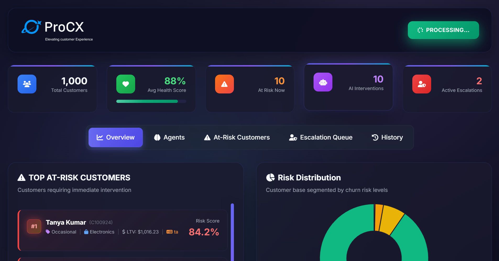
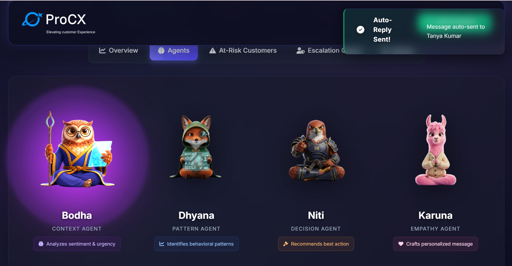
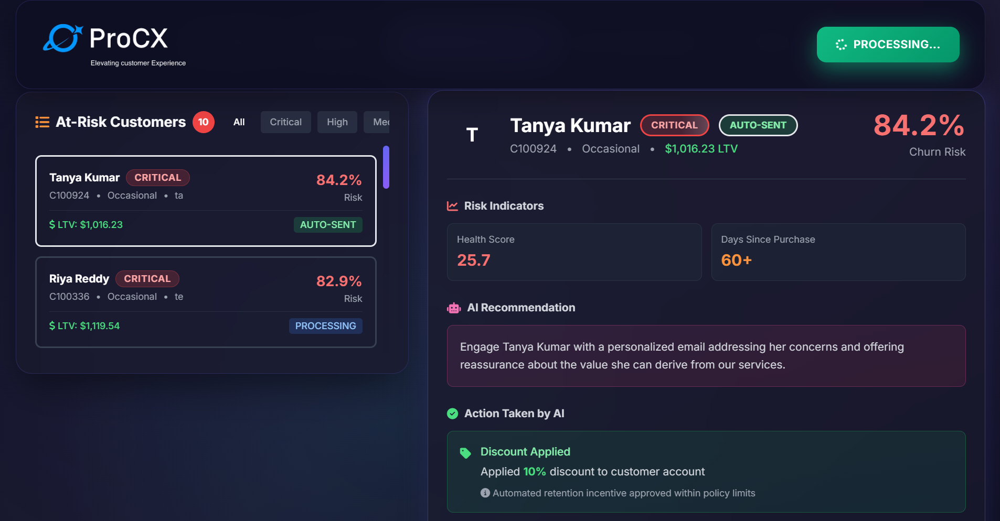
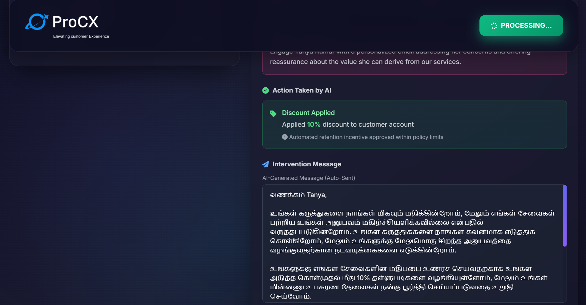
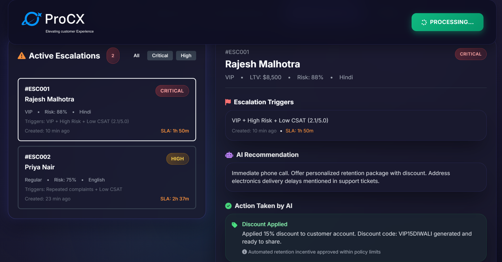
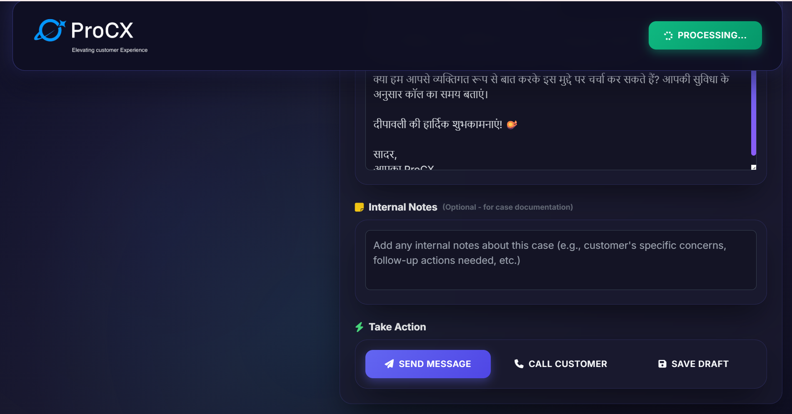
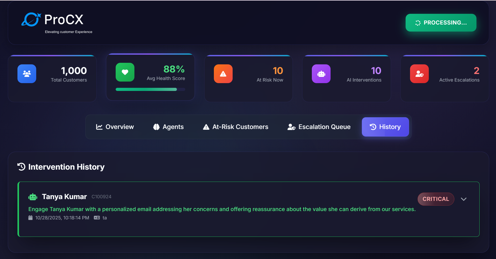

# 🧠 ProCX - Proactive Customer Experience Platform

[](https://github.com/langchain-ai/langgraph)
[](https://github.com/langchain-ai/langchain)
[](https://www.python.org/)

**ProCX** is an intelligent, multi-agent AI platform that transforms customer experience management through **100% proactive** intervention - predicting and preventing churn BEFORE customers complain or leave.

Built for the **AgentMAX Hackathon 2025** using LangGraph, LangChain, and OpenAI GPT-4.

---

## 📸 Application Screenshots

### Dashboard Overview


_Real-time monitoring dashboard showing customer health metrics, at-risk customers, and AI interventions_

### 4-Agent Pipeline in Action


_Meet our 4 specialized AI agents: Bodha, Dhyana, Niti, and Karuna working together_

### At-Risk Customer Management


_Detailed view of at-risk customers with AI recommendations and priority levels_

### AI-Generated Personalized Messages


_Multi-language, culturally-aware messages generated by AI - Tamil example shown_

### Human Escalation Queue


_Critical cases escalated to human agents with AI-prepared context and recommendations_

### Escalation Details with Messaging


_Full escalation view showing Hindi-language personalized message with Diwali greetings_

### Intervention History


_Complete history of all AI interventions and their outcomes_

---

## 🎯 The Problem We Solve

Traditional customer service is **reactive** - companies wait for customers to complain, then scramble to fix issues. By then, damage is already done and customers are often lost.

**ProCX flips the script with 100% proactive intelligence:**

- 🔮 **Predicts** churn risk before customers complain
- 🛡️ **Prevents** churn with early, culturally-aware interventions
- 📊 **Protects** revenue by saving at-risk customers proactively
- 🧠 **Learns** from historical patterns and resolution effectiveness
- 🌍 **Adapts** messaging for cultural context (festivals, language, timing)

---

## 🌟 Key Features

### 1. 🔮 Proactive Monitoring

- **Real-time health scoring** using 10-dimensional customer health model
- **Automated scanning** to identify at-risk customers before complaints
- **Pre-emptive intervention** generation with escalation continuity
- **Dashboard visualization** of customer health distribution
- **No reactive mode** - pure prevention focus

### 2. 🧠 Multi-Agent

Four specialized agents working in sequence:

- **Bodha (बोध) - Awareness**: Context extraction and sentiment analysis
- **Dhyana (ध्यान) - Insight**: Pattern mining and churn prediction
- **Niti (नीति) - Strategy**: Decision making and escalation logic
- **Karuna (करुणा) - Compassion**: Empathetic, culturally-aware messaging

### 3. �️ Escalation Continuity & Memory

- **Escalation tracking** prevents duplicate automated interventions
- **Interaction history** preserves context across scans
- **Human-in-the-loop** integration with skip logic
- **JSONL persistence** for transparent audit trails

### 4. 📊 Comprehensive Data Integration

- **5-sheet dataset**: customers, orders, support_tickets, churn_labels, nps_surveys
- **Real-time analytics** on customer cohorts and segment comparisons
- **10-factor health scoring** algorithm with weighted calculations
- **Hybrid churn risk model**: 70% behavioral + 30% ML predicted

---

## 🚀 Quick Start

### Prerequisites

```bash
Python 3.11+
OpenAI API Key
```

### Installation & Setup

1. **Clone the repository**

```bash
git clone https://github.com/vijay-jha-dc/ProCX.git
cd ProCX
```

2. **Install dependencies**

```bash
pip install -r requirements.txt
```

3. **Configure environment**

```bash
# Create .env file
cp .env.example .env

# Add your OpenAI API key to .env
OPENAI_API_KEY=your-api-key-here
```

### Running the Application

#### 🎨 **Option 1: Web Dashboard**

Start the web interface with real-time processing:

```bash
python api/backend_api.py
```

Then open your browser to: **http://localhost:5000**

**Features:**

- 📊 Real-time customer health monitoring
- 🤖 Live 4-agent pipeline visualization
- 📈 Interactive risk distribution charts
- 🚨 Escalation queue management
- 📜 Intervention history tracking

#### 🖥️ **Option 2: CLI Mode**

For command-line interaction:

```bash
# View customer health dashboard
python main.py --dashboard

# Run proactive interventions
python main.py --interventions

# Process specific number of customers
python main.py --interventions --max-interventions 10
```

See [docs/commands.txt](./docs/commands.txt) for all available commands.

---

## ⚙️ Architecture

See [ARCHITECTURE.md](./docs/ARCHITECTURE.md) for detailed system diagrams including:

- End-to-end system architecture
- Agent communication protocol
- Performance metrics and design philosophy

### Agent Responsibilities

| Agent      | Sanskrit           | Purpose                                 | Key Outputs                            |
| ---------- | ------------------ | --------------------------------------- | -------------------------------------- |
| **Bodha**  | बोध (Awareness)    | Context extraction & sentiment analysis | Context summary, risk signals          |
| **Dhyana** | ध्यान (Insight)    | Pattern mining & churn prediction       | Patterns, insights, churn risk         |
| **Niti**   | नीति (Strategy)    | Decision making & escalation logic      | Action plan, priority, escalation flag |
| **Karuna** | करुणा (Compassion) | Empathetic messaging generation         | Personalized response, tone            |

---

## � Project Scope

### Current Implementation

See our complete current scope visualization:

**[📸 View Current Scope Diagram →](./docs/scope/current.png)**

**What's Built:**

- ✅ Multi-agent LangGraph workflow
- ✅ 10-factor health scoring algorithm
- ✅ Hybrid churn risk model (70% behavioral + 30% ML)
- ✅ Proactive monitoring dashboard
- ✅ Escalation continuity & skip logic
- ✅ JSONL memory persistence

### Future Vision

See how we envision ProCX evolving:

**[🚀 View Future Roadmap →](./docs/scope/future.png)**

**Planned Enhancements:**

- Real-time event streaming architecture
- Multi-channel delivery (Email/SMS/WhatsApp)
- Interactive web dashboard with analytics
- A/B testing framework for optimization
- Advanced ML models and forecasting

---

🚀 **ProCX - Because prevention is better than cure!**
